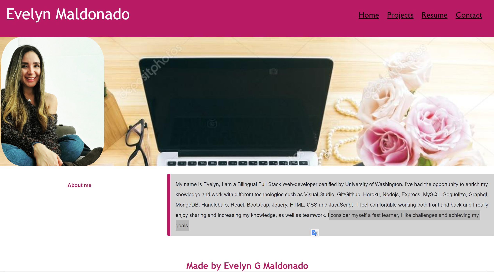

# React Portfolio

## Table of contents
1. [Description](#description)
2. [Installation](#installation)
3. [Usage](#usage)
4. [License](#license)
5. [Credits](#credits)
6. [Tests](#tests)
7. [Questions](#questions)
8. [More](#more)

<h2 id="description"> Project Description </h2>
A professional portfolio is an excellent way to present your work to potential employers and display the skills that qualify you for a position; it can contain proof of your skills, samples, visual demonstrations of your craft and letters of recommendation along with your resume. This React Professional Portfolio has been built from scratch and I have added skills and projects along the way during my certification.

## Installation 
Requiered dependencies: react,bootstrap, react-pdf, scripts, router-dom, dom.

## Usage 
An online portfolio allows you to share your work with a wider audience and can be accessed when your audience has time dedicated to review your breadth of work. It is important to have a portfolio with deployed web applications so the companies and future employers will see and have a better idea of your work and skills.

## License 
This application is covered under the GNU GPLv3.0 License.

## Credits 
Evelyn G Maldonado.

## Tests 
No tests.

## Questions 
If you have any questions, please contact me to the information listed below.

* Email: evelyn.gmaldonado@gmail.com
* GitHub: [EvelynGMaldonado](https://github.com/EvelynGMaldonado)

## More

* Link to the GitHub Repository:
[React Portfolio](https://github.com/EvelynGMaldonado/evelyngm_portfolio)

* Url to the deployed application:
[React Portfolio](https://evelyngmaldonado-portfolio.herokuapp.com/)
